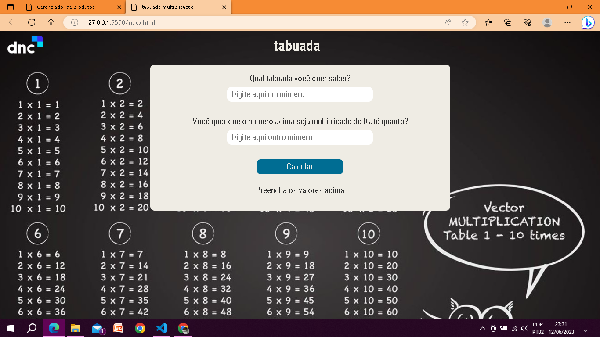

# Multiplication table (Tabuada de multiplicação)

#### Este projeto consiste em uma tabuada de multiplicação, com ela eu escolho o número que quero saber a tabuada seguido por até que número eu quero que seja feita a multiplicação.

## Tecnologias Utilizadas 
    Para fazer Esse projeto foram  utilizadas as seguintes tecnologias:
- HTML5;
- CSS3;
- Javascript.

## Instalação

1. Clone o repositório: `git clone https://github.com/usrjair0/multiplication_table.git`
2. Entre na pasta do projeto: `cd multiplication_table`
3. Instale as dependências: `npm install` 

## Uso 🧐

### A utilização é simples e bem intuitiva.  
 Aqui temos uma imagem do projeto no computador 💻: 👇   
   
 e aqui no celular :iphone:: 👇   

## Licença

Indique a licença sob a qual o seu projeto está disponibilizado. Por exemplo, você pode utilizar a Licença MIT ou qualquer outra licença adequada ao seu projeto.

## Contato

Forneça informações de contato, caso as pessoas queiram se comunicar com você sobre o projeto. Você pode incluir seu e-mail ou links para suas redes sociais.

